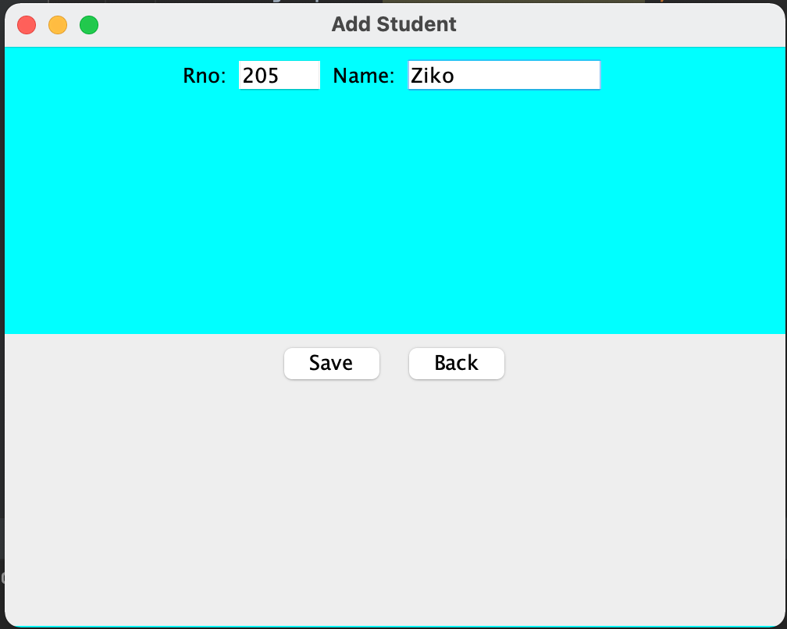
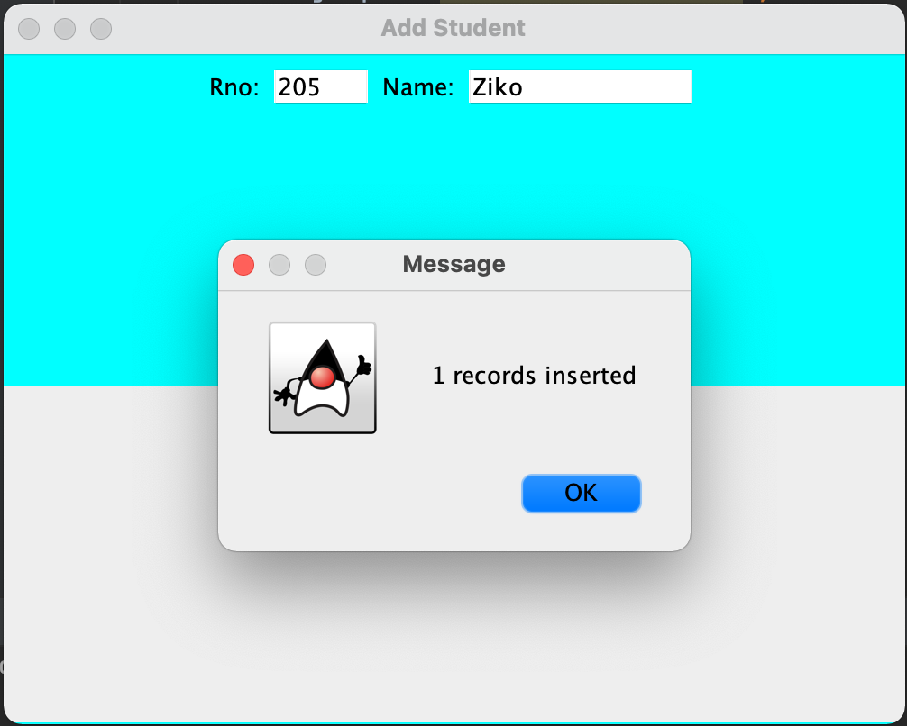
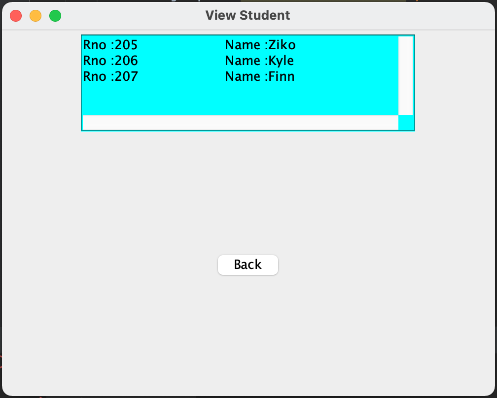

On this project worked: 
                       Ziedillo Shakirov and
                       Kypchakbaev Kairat

# Ala-Too University Student Management System

Create a Table in Mysql named 'student' in db2 database
 
 SQL QUERY:
 
      CREATE TABLE `student` (
        `rno` int(11) NOT NULL,
        `name` varchar(45) DEFAULT NULL,
        PRIMARY KEY (`rno`)
      ) 
      
      

